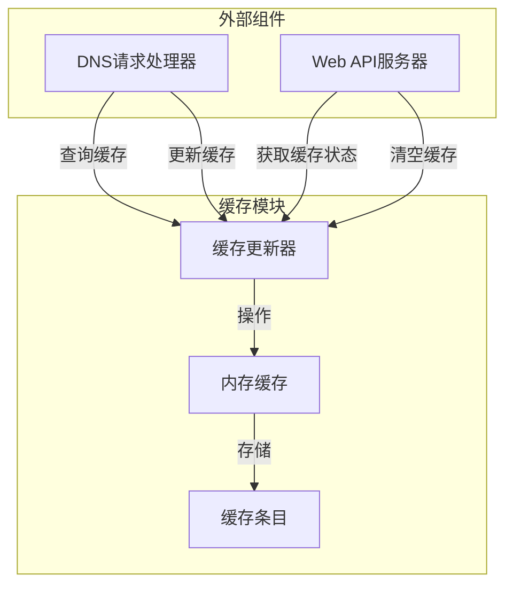
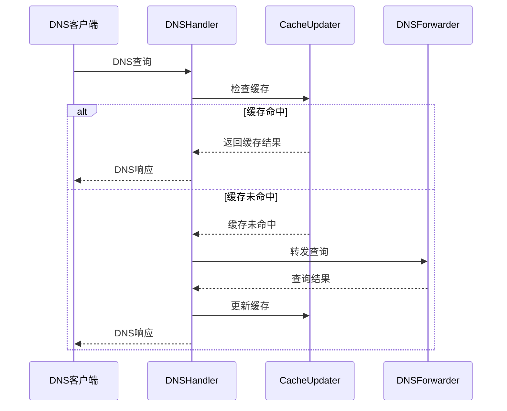

# SteadyDNS 缓存模块处理逻辑说明

## 1. 缓存模块架构

### 1.1 核心组件

| 组件 | 职责 | 文件 |
|------|------|------|
| CacheUpdater | 缓存更新器，提供缓存操作接口 | core/sdns/cache.go |
| MemoryCache | 内存缓存实现，核心缓存存储 | core/sdns/memorycache.go |
| CacheEntry | 缓存条目，存储DNS响应及元数据 | core/sdns/memorycache.go |

### 1.2 组件关系



## 2. 缓存处理流程

### 2.1 DNS查询缓存流程

1. **查询缓存**：
   - DNSHandler 接收DNS查询请求
   - 调用 `CacheUpdater.CheckCache()` 检查缓存
   - `CacheUpdater` 调用 `MemoryCache.Get()` 获取缓存条目
   - 如果缓存命中，直接返回缓存的响应

2. **更新缓存**：
   - 如果缓存未命中，DNSHandler 转发查询
   - 收到响应后，调用 `CacheUpdater.UpdateCacheWithResult()` 更新缓存
   - `CacheUpdater` 调用 `MemoryCache.Set()` 存储响应

3. **缓存清理**：
   - 定期清理过期条目（默认每60秒）
   - 当缓存大小达到阈值时，清理部分缓存条目
   - 当缓存大小超过限制时，移除最久未使用的条目

### 2.2 缓存键生成

缓存键由DNS查询的三个部分组成：
- 域名（Name）
- 记录类型（Qtype）
- 查询类（Qclass）

格式：`域名|记录类型|查询类`

```go
func getCacheKey(query *dns.Msg) string {
    if len(query.Question) == 0 {
        return ""
    }
    q := query.Question[0]
    return q.Name + "|" + dns.TypeToString[q.Qtype] + "|" + dns.ClassToString[q.Qclass]
}
```

### 2.3 TTL计算

缓存条目TTL的计算优先级：
1. 使用DNS响应中记录的TTL值
2. 如果响应中没有TTL，使用基于记录类型的默认TTL
3. 如果记录类型没有默认TTL，使用通用默认TTL（3600秒）

记录类型默认TTL映射：

| 记录类型 | 默认TTL | 说明 |
|---------|--------|------|
| A | 3600秒 | A记录默认1小时 |
| AAAA | 3600秒 | AAAA记录默认1小时 |
| CNAME | 7200秒 | CNAME记录默认2小时 |
| MX | 86400秒 | MX记录默认1天 |
| NS | 86400秒 | NS记录默认1天 |
| SOA | 86400秒 | SOA记录默认1天 |
| TXT | 3600秒 | TXT记录默认1小时 |
| SRV | 3600秒 | SRV记录默认1小时 |
| PTR | 3600秒 | PTR记录默认1小时 |
| NAPTR | 3600秒 | NAPTR记录默认1小时 |
| DS | 86400秒 | DS记录默认1天 |
| RRSIG | 86400秒 | RRSIG记录默认1天 |
| DNSKEY | 86400秒 | DNSKEY记录默认1天 |
| NSEC | 86400秒 | NSEC记录默认1天 |
| NSEC3 | 86400秒 | NSEC3记录默认1天 |
| ANY | 300秒 | ANY记录默认5分钟 |

## 3. 核心功能实现

### 3.1 缓存存储（MemoryCache.Set）

```go
func (c *MemoryCache) Set(msg *dns.Msg) error {
    // 1. 生成缓存键
    key := getCacheKey(msg)
    
    // 2. 计算TTL
    ttl := c.errorTTL
    if len(msg.Answer) > 0 {
        // 使用响应中的TTL或默认值
    }
    
    // 3. 创建缓存条目
    entry := &CacheEntry{
        Response:   msg.Copy(),
        ExpireTime: time.Now().Add(ttl),
        Size:       calculateSize(msg),
        LastAccess: time.Now(),
    }
    
    // 4. 检查缓存大小，必要时清理
    if usagePercent > c.cleanupThreshold {
        c.cleanupByPercentage(cleanupPercentage)
    }
    
    // 5. 确保缓存大小不超过限制
    for c.currentSize+int64(size) > c.maxSize {
        c.evictLRU()
    }
    
    // 6. 添加或更新缓存条目
    c.cache[key] = entry
    c.currentSize += int64(size)
    
    return nil
}
```

### 3.2 缓存查询（MemoryCache.Get）

```go
func (c *MemoryCache) Get(query *dns.Msg) *dns.Msg {
    // 1. 生成缓存键
    key := getCacheKey(query)
    
    // 2. 检查缓存是否存在
    entry, ok := c.cache[key]
    if !ok {
        c.missCount++
        return nil
    }
    
    // 3. 检查是否过期
    if time.Now().After(entry.ExpireTime) {
        // 移除过期条目
        c.currentSize -= int64(entry.Size)
        delete(c.cache, key)
        c.missCount++
        return nil
    }
    
    // 4. 更新最后访问时间
    entry.LastAccess = time.Now()
    c.hitCount++
    
    // 5. 复制响应并更新ID
    response := entry.Response.Copy()
    response.Id = query.Id
    
    return response
}
```

### 3.3 缓存清理机制

#### 3.3.1 定期清理（过期条目）

```go
func (c *MemoryCache) startCleanup() {
    ticker := time.NewTicker(c.cleanupInterval)
    defer ticker.Stop()
    
    for range ticker.C {
        c.cleanupExpired()
    }
}

func (c *MemoryCache) cleanupExpired() {
    now := time.Now()
    for key, entry := range c.cache {
        if now.After(entry.ExpireTime) {
            c.currentSize -= int64(entry.Size)
            delete(c.cache, key)
        }
    }
}
```

#### 3.3.2 阈值清理（大小限制）

当缓存使用达到阈值时，根据使用百分比清理不同比例的缓存：
- 使用 > 90%：清理50%
- 使用 > 80%：清理30%
- 其他情况：清理20%

```go
func (c *MemoryCache) cleanupByPercentage(percentage float64) {
    // 计算需要清理的条目数量
    targetCount := int(float64(len(c.cache)) * percentage)
    
    // 按最后访问时间排序
    // 清理最旧的条目
}
```

#### 3.3.3 LRU清理（空间不足）

当缓存大小超过限制时，移除最久未使用（LRU）的条目：

```go
func (c *MemoryCache) evictLRU() {
    // 找到最久未使用的条目
    var oldestKey string
    var oldestTime time.Time
    
    for key, entry := range c.cache {
        if oldestKey == "" || entry.LastAccess.Before(oldestTime) {
            oldestKey = key
            oldestTime = entry.LastAccess
        }
    }
    
    // 移除最旧的条目
    if oldestKey != "" {
        c.currentSize -= int64(c.cache[oldestKey].Size)
        delete(c.cache, oldestKey)
        c.evictionCount++
    }
}
```

## 4. 缓存配置管理

### 4.1 配置项

| 配置项 | 默认值 | 说明 | 配置文件路径 |
|--------|--------|------|-------------|
| DNS_CACHE_SIZE_MB | 100 | 缓存大小限制（MB） | [Cache] 节 |
| DNS_CACHE_CLEANUP_INTERVAL | 60 | 缓存清理间隔（秒） | [Cache] 节 |
| DNS_CACHE_ERROR_TTL | 3600 | 错误缓存TTL（秒） | [Cache] 节 |
| DNS_CACHE_CLEANUP_THRESHOLD | 0.75 | 清理阈值（0-1） | [Cache] 节 |

### 4.2 配置加载流程

1. 从配置文件读取配置值
2. 如果配置文件不存在或配置值无效，使用默认值
3. 环境变量优先级高于配置文件

```go
func NewMemoryCache() *MemoryCache {
    // 从配置获取缓存大小
    var maxSizeMB int
    if size := common.GetConfig("Cache", "DNS_CACHE_SIZE_MB"); size != "" {
        if s, err := strconv.Atoi(size); err == nil && s > 0 {
            maxSizeMB = s
        } else {
            maxSizeMB = 100 // 默认100MB
        }
    } else {
        maxSizeMB = 100 // 默认100MB
    }
    
    // 获取其他配置...
    
    return cache
}
```

## 5. 缓存统计与监控

### 5.1 统计指标

| 指标 | 说明 |
|------|------|
| count | 缓存条目数量 |
| currentSize | 当前缓存大小（字节） |
| maxSize | 最大缓存大小（字节） |
| usagePercent | 缓存使用百分比 |
| hitCount | 缓存命中次数 |
| missCount | 缓存未命中次数 |
| totalRequests | 总请求次数 |
| hitRate | 缓存命中率 |
| evictionCount | 缓存驱逐次数 |
| cleanupCount | 清理执行次数 |

### 5.2 统计信息获取

```go
func (c *CacheUpdater) GetCacheStats() map[string]interface{} {
    return c.cache.Stats()
}
```

### 5.3 API接口

- **获取缓存状态**：`GET /api/cache`
- **清空缓存**：`POST /api/cache/clear`

## 6. 性能优化策略

### 6.1 缓存大小优化

- **建议值**：50-500MB
- **小内存服务器**：50-100MB
- **大内存服务器**：200-500MB
- **监控指标**：关注 `usagePercent` 和 `hitRate`

### 6.2 清理间隔优化

- **默认值**：60秒
- **高频查询场景**：30-60秒
- **低频查询场景**：120-300秒
- **监控指标**：关注清理频率和系统负载

### 6.3 TTL优化

- **常用域名**：较短TTL（300-1800秒）
- **稳定域名**：较长TTL（3600-86400秒）
- **错误响应**：适中TTL（1800-3600秒）

### 6.4 缓存键优化

- **使用标准格式**：域名+记录类型+查询类
- **统一域名格式**：确保域名规范化（如小写、结尾点）
- **避免缓存污染**：对异常查询进行过滤

## 7. 缓存模块与其他模块集成

### 7.1 与DNS处理模块集成



### 7.2 与Web API模块集成

- **缓存状态API**：提供缓存使用情况、命中率等统计信息
- **缓存管理API**：支持手动清空缓存
- **监控集成**：将缓存统计纳入仪表盘监控

## 8. 常见问题与解决方案

### 8.1 缓存命中率低

**可能原因**：
- 缓存大小过小
- TTL设置过短
- 查询模式多样化
- 缓存键冲突

**解决方案**：
- 增加缓存大小
- 调整TTL策略
- 优化缓存键生成
- 分析查询模式，针对性优化

### 8.2 缓存内存使用过高

**可能原因**：
- 缓存大小设置过大
- 清理间隔过长
- 存在大量大尺寸响应

**解决方案**：
- 调整缓存大小限制
- 缩短清理间隔
- 对大尺寸响应进行特殊处理
- 监控缓存大小变化趋势

### 8.3 缓存过期频繁

**可能原因**：
- TTL设置过短
- 清理间隔过短
- 缓存大小限制过小

**解决方案**：
- 调整TTL策略
- 优化清理间隔
- 适当增加缓存大小
- 分析过期原因，针对性优化

## 9. 代码优化建议

### 9.1 性能优化

1. **缓存键生成优化**：
   - 使用更高效的缓存键生成算法
   - 考虑使用哈希值减少键长度

2. **内存使用优化**：
   - 实现更紧凑的缓存条目结构
   - 考虑使用对象池减少内存分配

3. **并发性能优化**：
   - 考虑使用分片锁减少锁竞争
   - 优化清理操作的并发性能

### 9.2 功能增强

1. **缓存持久化**：
   - 实现缓存的磁盘持久化
   - 支持缓存预热功能

2. **智能缓存策略**：
   - 基于查询频率动态调整TTL
   - 实现缓存优先级机制

3. **监控增强**：
   - 增加更详细的缓存监控指标
   - 实现缓存使用趋势分析

4. **安全增强**：
   - 对缓存内容进行验证
   - 防止缓存投毒攻击

## 10. 总结

### 10.1 缓存模块特点

- **高性能**：内存缓存，快速响应
- **智能**：自动过期、LRU清理、大小限制
- **可配置**：支持多种配置项，适应不同场景
- **监控友好**：提供详细的统计信息
- **安全可靠**：支持DNS响应验证

### 10.2 技术亮点

1. **多级缓存清理机制**：
   - 定期清理过期条目
   - 阈值触发清理
   - LRU驱逐策略

2. **智能TTL管理**：
   - 基于响应TTL
   - 基于记录类型的默认TTL
   - 错误响应特殊处理

3. **全面的统计监控**：
   - 命中率、使用率等核心指标
   - 详细的操作统计
   - API接口暴露

4. **灵活的配置系统**：
   - 支持配置文件和环境变量
   - 合理的默认值
   - 运行时配置生效

### 10.3 应用价值

- **提升DNS服务器性能**：减少重复查询，提高响应速度
- **降低上游DNS服务器负载**：减少转发查询次数
- **增强系统稳定性**：缓存错误响应，减少错误传播
- **提供监控数据**：帮助运维人员了解系统运行状态
- **支持故障恢复**：缓存可在网络故障时提供部分服务

通过以上设计，SteadyDNS 缓存模块实现了高效、智能、可靠的DNS查询缓存功能，为整个DNS服务器系统的性能和稳定性提供了重要保障。