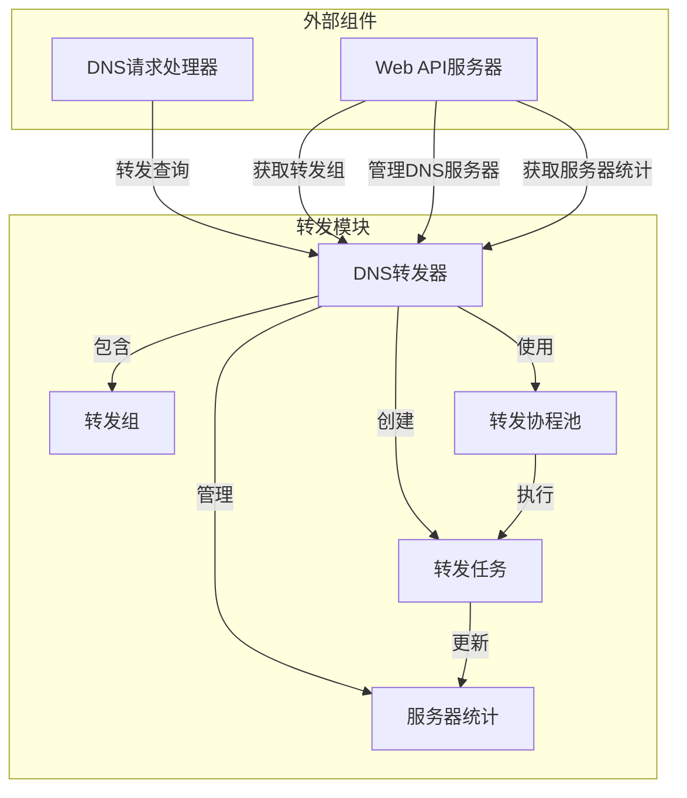
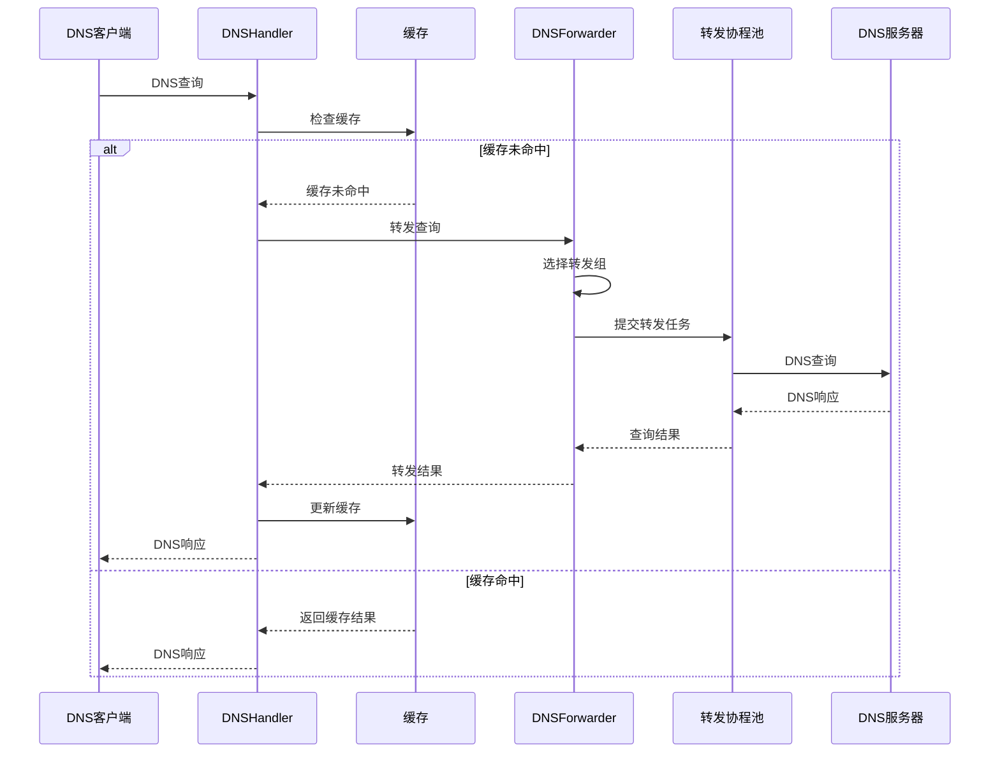

# SteadyDNS DNS转发模块处理逻辑说明

## 1. 转发模块架构

### 1.1 核心组件

| 组件 | 职责 | 文件 |
|------|------|------|
| DNSForwarder | 主转发器，管理转发组和服务器统计 | core/sdns/forwardgroup.go |
| ForwardGroup | 转发服务器组，包含多个优先级队列 | core/sdns/forwardgroup.go |
| ForwardWorkerPool | 专用DNS转发协程池 | core/sdns/forwardgroup.go |
| DNSForwardTask | DNS转发任务，封装单个服务器查询 | core/sdns/forwardgroup.go |
| ServerStats | 服务器统计信息 | core/sdns/forwardgroup.go |

### 1.2 组件关系



## 2. 转发处理流程

### 2.1 DNS查询转发流程

1. **查询接收**：
   - DNSHandler 接收DNS查询请求
   - 调用 `DNSForwarder.ForwardQuery()` 转发查询

2. **转发组选择**：
   - 尝试使用名为 "Default" 的转发组
   - 如果默认组不存在，使用第一个可用的转发组
   - 如果没有可用的转发组，返回错误

3. **优先级队列处理**：
   - 调用 `tryForwardWithPriority()` 按优先级转发
   - 从优先级 1 开始，依次尝试各个优先级队列
   - 每个优先级队列启动后，等待指定间隔再启动下一队列

4. **任务提交**：
   - 为每个服务器创建 `DNSForwardTask`
   - 通过 `ForwardWorkerPool.SubmitTask()` 提交任务
   - 协程池执行DNS查询

5. **结果处理**：
   - 监听 `resultChan` 接收查询结果
   - 收到结果后立即取消其他查询
   - 整体超时时间为 5 秒

6. **统计更新**：
   - 查询完成后更新服务器统计信息
   - 包括查询次数、成功/失败次数、响应时间等

### 2.2 优先级队列策略

| 优先级 | 描述 | 启动时机 |
|--------|------|---------|
| 1 | 最高优先级 | 立即启动 |
| 2 | 中等优先级 | 优先级1启动后等待50ms |
| 3 | 最低优先级 | 优先级2启动后等待50ms |

### 2.3 取消机制

- **整体取消**：收到结果后立即关闭 `cancelChan`
- **任务级取消**：任务执行前检查取消信号
- **超时取消**：整体查询超时后关闭 `cancelChan`

## 3. 核心功能实现

### 3.1 转发查询（ForwardQuery）

```go
func (f *DNSForwarder) ForwardQuery(query *dns.Msg) (*dns.Msg, error) {
    // 1. 提取查询信息
    var queryDomain, queryType string
    if len(query.Question) > 0 {
        queryDomain = query.Question[0].Name
        queryType = dns.TypeToString[query.Question[0].Qtype]
    }

    // 2. 选择转发组
    defaultGroup, exists := f.groups["Default"]
    if !exists {
        // 尝试获取第一个组
        for _, group := range f.groups {
            defaultGroup = group
            break
        }
    }

    // 3. 执行优先级转发
    result, err := f.tryForwardWithPriority(defaultGroup, query)

    if err == nil && result != nil {
        return result, nil
    }

    return nil, fmt.Errorf("所有转发服务器都不可用")
}
```

### 3.2 优先级转发（tryForwardWithPriority）

```go
func (f *DNSForwarder) tryForwardWithPriority(group *ForwardGroup, query *dns.Msg) (*dns.Msg, error) {
    // 1. 设置超时和间隔
    overallTimeout := 5 * time.Second
    priorityInterval := f.priorityTimeout

    // 2. 创建通道
    resultChan := make(chan *dns.Msg, 10)
    errorChan := make(chan error, 10)
    cancelChan := make(chan struct{})

    // 3. 按优先级启动查询
    for priority := 1; priority <= 3; priority++ {
        servers, exists := group.PriorityQueues[priority]
        if !exists || len(servers) == 0 {
            continue
        }

        // 4. 为每个服务器创建任务
        for i, server := range servers {
            addr := fmt.Sprintf("%s:%d", server.Address, server.Port)
            task := &DNSForwardTask{
                address:    addr,
                query:      query,
                resultChan: resultChan,
                errorChan:  errorChan,
                forwarder:  f,
                cancelChan: cancelChan,
            }
            f.forwardPool.SubmitTask(task)
        }

        // 5. 等待间隔后启动下一优先级
        if priority < 3 {
            select {
            case <-time.After(priorityInterval):
                // 等待完成，继续
            case result := <-resultChan:
                // 已收到结果，直接返回
                close(cancelChan)
                return result, nil
            case <-cancelChan:
                // 已收到取消信号，直接返回
                return nil, fmt.Errorf("查询被取消")
            }
        }
    }

    // 6. 等待整体超时或结果
    select {
    case result := <-resultChan:
        close(cancelChan)
        return result, nil
    case <-time.After(overallTimeout):
        // 整体超时处理
        // ...
    }
}
```

### 3.3 任务处理（DNSForwardTask.Process）

```go
func (t *DNSForwardTask) Process() {
    // 1. 执行DNS查询
    result, err := t.forwarder.forwardToServer(t.address, t.query, t.cancelChan)

    // 2. 检查取消信号
    select {
    case <-t.cancelChan:
        // 收到取消信号
        if err == nil && result != nil {
            // 尝试发送结果
            select {
            case t.resultChan <- result:
            default:
                // 结果发送失败
            }
        }
        return
    default:
        // 3. 处理查询结果
        if err == nil && result != nil {
            t.resultChan <- result
        } else {
            t.errorChan <- err
        }
    }
}
```

### 3.4 服务器查询（forwardToServer）

```go
func (f *DNSForwarder) forwardToServer(addr string, query *dns.Msg, cancelChan chan struct{}) (*dns.Msg, error) {
    startTime := time.Now()

    // 1. 获取服务器统计信息
    stats := f.getOrCreateServerStats(addr)

    // 2. 创建结果通道
    resultChan := make(chan *dns.Msg, 1)
    errorChan := make(chan error, 1)

    // 3. 执行DNS查询
    go func() {
        c := new(dns.Client)
        c.Timeout = 5 * time.Second
        result, rtt, err := c.Exchange(query, addr)
        if err != nil {
            errorChan <- err
            return
        }
        if result == nil {
            errorChan <- fmt.Errorf("DNS查询返回空结果")
            return
        }
        if result.Rcode != dns.RcodeSuccess {
            errorChan <- fmt.Errorf("DNS查询失败，返回码: %d", result.Rcode)
            return
        }
        resultChan <- result
    }()

    // 4. 等待结果或取消信号
    select {
    case <-cancelChan:
        return nil, fmt.Errorf("查询被取消")
    case result := <-resultChan:
        // 更新成功统计
        stats.Mu.Lock()
        stats.Queries++
        stats.SuccessfulQueries++
        stats.TotalResponseTime += time.Since(startTime)
        stats.LastQueryTime = time.Now()
        stats.LastSuccessfulQueryTime = time.Now()
        stats.WindowQueries++
        stats.Status = "healthy"
        stats.Mu.Unlock()
        return result, nil
    case err := <-errorChan:
        // 更新失败统计
        stats.Mu.Lock()
        stats.Queries++
        stats.FailedQueries++
        stats.LastQueryTime = time.Now()
        // 检查失败率，超过50%标记为不健康
        if stats.Queries > 10 && float64(stats.FailedQueries)/float64(stats.Queries) > 0.5 {
            stats.Status = "unhealthy"
        }
        stats.Mu.Unlock()
        return nil, err
    }
}
```

## 4. 协程池管理

### 4.1 协程池创建

```go
func NewForwardWorkerPool(workerCount int) *ForwardWorkerPool {
    if workerCount <= 0 {
        workerCount = 50000 // 默认值
    }

    pool := &ForwardWorkerPool{
        taskChan:    make(chan *DNSForwardTask, workerCount*2), // 队列大小为协程数的2倍
        workerCount: workerCount,
        shutdown:    false,
    }

    // 启动工作协程
    for i := 0; i < workerCount; i++ {
        pool.wg.Add(1)
        go pool.worker()
    }

    return pool
}
```

### 4.2 任务提交

```go
func (p *ForwardWorkerPool) SubmitTask(task *DNSForwardTask) {
    select {
    case p.taskChan <- task:
        // 任务已加入队列
    default:
        // 队列已满，直接在当前协程中执行
        task.Process()
    }
}
```

### 4.3 工作协程

```go
func (p *ForwardWorkerPool) worker() {
    defer p.wg.Done()

    for {
        select {
        case task, ok := <-p.taskChan:
            if !ok {
                return
            }
            // 处理任务
            task.Process()
        }
    }
}
```

## 5. 健康检查机制

### 5.1 健康检查流程

1. **启动健康检查**：
   - DNSForwarder 启动时调用 `StartHealthChecks()`
   - 每 30 秒执行一次健康检查

2. **检查逻辑**：
   - 从当前活跃的转发组中获取服务器地址
   - 对每个服务器执行简单的 DNS 查询（查询 example.com）
   - 更新服务器健康状态和检查时间

3. **状态更新**：
   - 检查成功：设置状态为 "healthy"
   - 检查失败：设置状态为 "unhealthy"
   - 更新 `HealthCheckTime` 为当前时间

### 5.2 健康检查实现

```go
func (f *DNSForwarder) StartHealthChecks() {
    go func() {
        ticker := time.NewTicker(30 * time.Second)
        defer ticker.Stop()

        for range ticker.C {
            // 从当前活跃的groups中获取服务器地址
            f.mu.RLock()
            var servers []string
            for _, group := range f.groups {
                for _, priorityServers := range group.PriorityQueues {
                    for _, server := range priorityServers {
                        addr := fmt.Sprintf("%s:%d", server.Address, server.Port)
                        servers = append(servers, addr)
                    }
                }
            }
            f.mu.RUnlock()

            // 对每个活跃服务器进行健康检查
            for _, addr := range servers {
                go func(address string) {
                    healthy := f.CheckServerHealth(address)
                    stats := f.getOrCreateServerStats(address)
                    stats.Mu.Lock()
                    stats.HealthCheckTime = time.Now()
                    if healthy {
                        stats.Status = "healthy"
                        stats.LastSuccessfulQueryTime = time.Now()
                    } else {
                        stats.Status = "unhealthy"
                    }
                    stats.Mu.Unlock()
                }(addr)
            }
        }
    }()
}
```

## 6. 服务器统计管理

### 6.1 统计指标

| 指标 | 说明 |
|------|------|
| Queries | 总查询次数 |
| SuccessfulQueries | 成功查询次数 |
| FailedQueries | 失败查询次数 |
| TotalResponseTime | 总响应时间 |
| LastQueryTime | 最后查询时间 |
| LastSuccessfulQueryTime | 最后成功查询时间 |
| HealthCheckTime | 最后健康检查时间 |
| Status | 服务器状态（healthy/unhealthy） |
| QPS | 查询每秒 |
| Latency | 平均延迟（毫秒） |
| WindowStartTime | 统计窗口开始时间 |
| WindowQueries | 统计窗口内查询次数 |

### 6.2 统计更新

```go
func (f *DNSForwarder) UpdateServerStats() {
    f.statsMu.RLock()
    defer f.statsMu.RUnlock()

    now := time.Now()

    for _, stats := range f.serverStats {
        stats.Mu.Lock()

        // 计算QPS
        windowDuration := now.Sub(stats.WindowStartTime)
        if windowDuration > time.Second {
            stats.QPS = float64(stats.WindowQueries) / windowDuration.Seconds()
            stats.WindowStartTime = now
            stats.WindowQueries = 0
        }

        // 计算平均延迟
        if stats.SuccessfulQueries > 0 {
            stats.Latency = float64(stats.TotalResponseTime.Milliseconds()) / float64(stats.SuccessfulQueries)
        }

        // 检查服务器健康状态
        if now.Sub(stats.LastSuccessfulQueryTime) > 30*time.Second {
            stats.Status = "unhealthy"
        }

        stats.Mu.Unlock()
    }
}
```

## 7. 配置管理

### 7.1 关键配置项

| 配置项 | 默认值 | 说明 | 配置文件路径 |
|--------|--------|------|-------------|
| DNS_CLIENT_WORKERS | 10000 | DNS客户端工作协程数 | [DNS] 节 |
| DNS_QUEUE_MULTIPLIER | 2 | 任务队列乘数 | [DNS] 节 |
| DNS_PRIORITY_TIMEOUT_MS | 50 | 优先级队列超时时间（毫秒） | [DNS] 节 |

### 7.2 协程池大小计算

- **默认值**：50000
- **计算公式**：协程池大小 = DNS_CLIENT_WORKERS * 5
- **队列大小**：协程池大小 * 2

## 8. 与其他模块集成

### 8.1 与DNS处理模块集成



### 8.2 与Web API模块集成

- **转发组管理**：
  - 获取所有转发组：`GET /api/forward-groups`
  - 获取单个转发组：`GET /api/forward-groups/{id}`
  - 创建转发组：`POST /api/forward-groups`
  - 更新转发组：`PUT /api/forward-groups/{id}`
  - 删除转发组：`DELETE /api/forward-groups/{id}`

- **DNS服务器管理**：
  - 获取所有服务器：`GET /api/forward-servers`
  - 获取单个服务器：`GET /api/forward-servers/{id}`
  - 创建服务器：`POST /api/forward-servers`
  - 更新服务器：`PUT /api/forward-servers/{id}`
  - 删除服务器：`DELETE /api/forward-servers/{id}`
  - 检查服务器健康：`GET /api/forward-servers/{id}?health=true`

- **服务器统计**：
  - 仪表盘API：`GET /api/dashboard/summary`
  - 包含服务器健康状态、响应时间等统计信息

## 9. 性能优化策略

### 9.1 协程池优化

- **协程池大小**：根据服务器CPU核心数和内存调整
- **建议值**：50000（默认值）
- **监控指标**：关注协程池使用率和系统负载

### 9.2 优先级策略优化

- **优先级间隔**：默认 50ms，可根据网络环境调整
- **建议值**：30-100ms
- **监控指标**：关注查询响应时间和成功率

### 9.3 超时设置优化

- **整体超时**：默认 5 秒，可根据网络环境调整
- **服务器超时**：默认 5 秒，建议与整体超时保持一致
- **监控指标**：关注超时率和查询失败率

### 9.4 健康检查优化

- **检查频率**：默认 30 秒，可根据服务器稳定性调整
- **建议值**：15-60 秒
- **监控指标**：关注健康检查成功率和服务器状态变化

## 10. 常见问题与解决方案

### 10.1 所有转发服务器都不可用

**可能原因**：
- 网络连接问题
- DNS服务器配置错误
- 防火墙阻止
- 健康检查失败

**解决方案**：
- 检查网络连接
- 验证DNS服务器地址和端口
- 检查防火墙设置
- 手动测试DNS服务器可用性

### 10.2 转发查询超时

**可能原因**：
- 网络延迟高
- DNS服务器响应慢
- 优先级间隔设置不合理
- 整体超时设置过短

**解决方案**：
- 检查网络延迟
- 调整DNS服务器优先级
- 优化优先级间隔设置
- 适当增加整体超时时间

### 10.3 协程池占满

**可能原因**：
- 并发查询量过高
- 协程池大小不足
- 任务处理时间过长

**解决方案**：
- 增加协程池大小
- 优化任务处理逻辑
- 实现任务排队机制
- 考虑限流措施

### 10.4 死锁问题

**可能原因**：
- 锁使用不当
- 通道操作不当
- 并发逻辑错误

**解决方案**：
- 使用分离的锁保护不同资源
- 确保通道操作不会阻塞
- 实现超时机制避免无限阻塞
- 使用 goroutine 监控和调试工具

## 11. 代码优化建议

### 11.1 性能优化

1. **连接池优化**：
   - 实现DNS连接池，复用TCP连接
   - 减少连接建立开销，提高查询效率

2. **缓存优化**：
   - 实现转发结果缓存
   - 减少重复查询，提高响应速度

3. **错误处理优化**：
   - 实现错误重试机制
   - 对临时错误进行特殊处理

4. **负载均衡**：
   - 实现基于服务器健康状态的负载均衡
   - 优先选择响应快、健康状态好的服务器

### 11.2 功能增强

1. **智能转发策略**：
   - 基于查询类型选择不同的转发服务器
   - 实现地理位置感知的转发策略

2. **安全增强**：
   - 实现DNSSEC验证
   - 增加服务器黑名单机制

3. **监控增强**：
   - 增加更详细的转发统计
   - 实现转发路径追踪

4. **配置灵活性**：
   - 支持基于域名的转发规则
   - 实现动态配置更新

## 12. 总结

### 12.1 转发模块特点

- **高性能**：专用协程池处理，支持高并发
- **可靠性**：优先级队列和健康检查机制
- **灵活性**：可配置的转发组和服务器
- **可监控**：详细的服务器统计和健康状态
- **安全性**：超时控制和错误处理

### 12.2 技术亮点

1. **优先级队列**：
   - 多级优先级确保查询快速响应
   - 间隔启动机制平衡速度和可靠性

2. **专用协程池**：
   - 高并发处理能力
   - 队列满时的降级处理

3. **智能健康检查**：
   - 定期检查服务器状态
   - 基于检查结果动态调整

4. **详细的统计信息**：
   - 实时服务器状态监控
   - 历史性能数据分析

5. **灵活的配置系统**：
   - 支持环境变量和配置文件
   - 合理的默认值和推荐范围

### 12.3 应用价值

- **提高DNS查询速度**：通过缓存和优先级转发
- **增强DNS服务可靠性**：多服务器冗余和健康检查
- **优化网络资源使用**：连接池和协程池管理
- **提供完整的监控能力**：实时统计和健康状态
- **支持复杂网络环境**：灵活的转发策略和配置

DNS转发模块是SteadyDNS的核心组件之一，通过高效的转发策略和可靠的服务器管理，为整个系统提供了稳定的DNS查询转发能力。