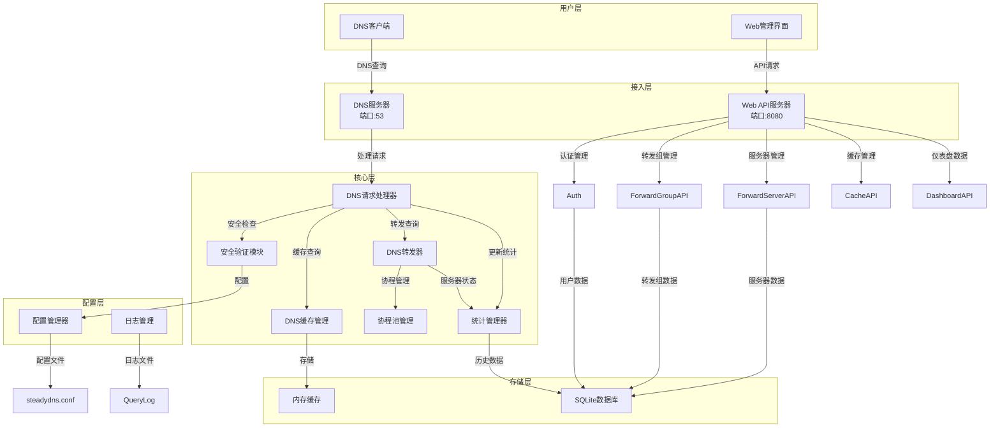

# SteadyDNS 项目详细设计文档

## 1. 项目概述

SteadyDNS 是一个高性能、安全可靠的 DNS 服务器系统，具有以下核心特性：

- **高性能处理**：支持 5W-10W 并发客户端查询，采用 TCP/UDP 连接池和协程池优化
- **安全防护**：内置 DNS 消息验证、查询速率限制、防止 DNS 投毒和放大攻击
- **灵活转发**：支持优先级队列转发策略，可配置多个 DNS 服务器
- **实时监控**：提供完整的仪表盘 API，实时收集和展示 DNS 服务器运行状态
- **可配置性**：采用 INI 格式配置文件，支持环境变量覆盖，便于部署和管理
- **完整的 Web 管理界面**：提供 API 接口，支持前端开发完整的管理界面

## 2. 系统架构

### 2.1 整体架构

SteadyDNS 采用分层架构设计，主要包含以下几层：

1. **用户层**：包括 DNS 客户端和 Web 管理界面
2. **接入层**：DNS 服务器（UDP/TCP 53端口）和 Web API 服务器（HTTP 8080端口）
3. **核心层**：DNS 处理、安全验证、缓存管理、转发处理、统计管理
4. **存储层**：SQLite 数据库和内存缓存
5. **配置层**：INI 配置文件和环境变量管理

### 2.2 核心模块关系



## 3. 核心功能模块设计

### 3.1 DNS 服务器模块 (`sdns`)

#### 3.1.1 DNS 服务器启动

- **功能**：启动 UDP 和 TCP DNS 服务器，监听 53 端口
- **实现**：`StartDNSServer` 函数，在独立协程中启动服务器
- **关键组件**：
  - `CustomDNSServer`：自定义 DNS 服务器实现
  - `WorkerPool`：协程池管理，处理并发查询
  - `DNSHandler`：DNS 请求处理器

#### 3.1.2 DNS 请求处理

- **功能**：处理 DNS 查询请求，包括安全验证、缓存查询、转发处理
- **流程**：
  1. 接收 DNS 查询
  2. 安全验证（消息大小、速率限制等）
  3. 缓存查询
  4. 转发查询（如果缓存未命中）
  5. 响应客户端
  6. 更新统计信息

#### 3.1.3 DNS 转发功能

- **功能**：将 DNS 查询转发到上游 DNS 服务器
- **实现**：`DNSForwarder` 结构体，支持优先级队列转发策略
- **关键特性**：
  - 优先级队列：按优先级顺序尝试转发
  - 超时管理：整体 5 秒超时，优先级队列间隔 50ms
  - 专用协程池：大小为 DNS 客户端协程的 5 倍
  - 健康检查：定期检查转发服务器状态

#### 3.1.4 缓存管理

- **功能**：缓存 DNS 查询结果，提高响应速度
- **实现**：内存缓存，支持 TTL 管理
- **关键参数**：
  - 缓存大小：默认 100MB
  - 清理间隔：默认 60 秒
  - 错误缓存 TTL：默认 3600 秒

#### 3.1.5 统计管理

- **功能**：收集和管理 DNS 服务器运行状态
- **实现**：`StatsManager` 结构体
- **统计数据**：
  - 网络统计（流量、连接数）
  - 域名查询统计
  - 客户端统计
  - QPS 历史记录
  - 延迟数据
  - 资源使用情况

### 3.2 Web API 模块 (`webapi`)

#### 3.2.1 认证系统

- **功能**：用户登录、令牌管理、权限控制
- **实现**：JWT 认证机制
- **关键特性**：
  - 双令牌系统（访问令牌和刷新令牌）
  - 令牌过期和刷新机制
  - 密码哈希存储

#### 3.2.2 转发组管理

- **功能**：管理 DNS 转发组配置
- **API 端点**：
  - GET /api/forward-groups：获取所有转发组
  - GET /api/forward-groups/{id}：获取单个转发组
  - POST /api/forward-groups：创建转发组
  - PUT /api/forward-groups/{id}：更新转发组
  - DELETE /api/forward-groups/{id}：删除转发组

#### 3.2.3 转发服务器管理

- **功能**：管理 DNS 转发服务器配置
- **API 端点**：
  - GET /api/forward-servers：获取所有服务器
  - GET /api/forward-servers/{id}：获取单个服务器
  - POST /api/forward-servers：创建服务器
  - PUT /api/forward-servers/{id}：更新服务器
  - DELETE /api/forward-servers/{id}：删除服务器
  - GET /api/forward-servers/{id}?health=true：检查服务器健康状态

#### 3.2.4 缓存管理

- **功能**：管理 DNS 缓存配置和状态
- **API 端点**：
  - GET /api/cache：获取缓存状态
  - POST /api/cache/clear：清除缓存

#### 3.2.5 仪表盘 API

- **功能**：提供实时监控数据
- **API 端点**：
  - GET /api/dashboard/summary：获取服务器摘要信息
  - GET /api/dashboard/top：获取热门查询
  - GET /api/dashboard/trends：获取趋势数据

### 3.3 数据库模块 (`database`)

#### 3.3.1 数据库初始化

- **功能**：初始化 SQLite 数据库，创建必要的表结构
- **实现**：`InitializeDatabase` 函数
- **表结构**：
  - users：用户表
  - forward_groups：转发组表
  - dns_servers：DNS 服务器表

#### 3.3.2 数据访问接口

- **功能**：提供数据库操作接口
- **实现**：
  - 用户管理：创建、查询、更新用户
  - 转发组管理：创建、查询、更新、删除转发组
  - DNS 服务器管理：创建、查询、更新、删除 DNS 服务器

### 3.4 配置管理模块 (`common`)

#### 3.4.1 配置文件管理

- **功能**：加载、解析和管理配置文件
- **实现**：`LoadConfig` 函数，支持 INI 格式
- **配置文件路径**：`./config/steadydns.conf`（相对于工作目录）
- **配置格式**：按节（Section）组织的键值对

#### 3.4.2 配置项

| 节 | 配置项 | 默认值 | 描述 |
|----|-------|-------|------|
| Database | DB_PATH | steadydns.db | 数据库文件路径 |
| Server | JWT_SECRET_KEY | your-default-jwt-secret-key | JWT 密钥 |
| Server | PORT | 8080 | API 服务器端口 |
| DNS | DNS_CLIENT_WORKERS | 10000 | DNS 客户端工作协程数 |
| DNS | DNS_QUEUE_MULTIPLIER | 2 | 任务队列乘数 |
| DNS | DNS_PRIORITY_TIMEOUT_MS | 50 | DNS 服务器优先级超时（毫秒） |
| Cache | DNS_CACHE_SIZE_MB | 100 | 缓存大小限制（MB） |
| Cache | DNS_CACHE_CLEANUP_INTERVAL | 60 | 缓存清理间隔（秒） |
| Cache | DNS_CACHE_ERROR_TTL | 3600 | 错误缓存 TTL（秒） |
| Logging | QUERY_LOG_PATH | log/ | 查询日志存储路径 |
| Logging | QUERY_LOG_MAX_SIZE | 10 | 查询日志文件大小限制（MB） |
| Logging | QUERY_LOG_MAX_FILES | 10 | 查询日志文件数量限制 |
| Logging | DNS_LOG_LEVEL | DEBUG | 日志级别 |
| Security | DNS_RATE_LIMIT_PER_IP | 60 | 每 IP DNS 查询速率限制（次/分钟） |
| Security | DNS_RATE_LIMIT_GLOBAL | 10000 | 全局 DNS 查询速率限制（次/分钟） |
| Security | DNS_BAN_DURATION | 5 | DNS 查询封禁持续时间（分钟） |
| Security | DNS_MESSAGE_SIZE_LIMIT | 4096 | DNS 消息大小限制（字节） |
| Security | DNS_VALIDATION_ENABLED | true | DNS 消息验证启用状态 |
| API | RATE_LIMIT_ENABLED | true | API 速率限制启用状态 |
| API | LOG_ENABLED | true | API 日志启用状态 |
| API | LOG_LEVEL | INFO | API 日志级别 |
| JWT | ACCESS_TOKEN_EXPIRATION | 30 | 访问令牌过期时间（分钟） |
| JWT | REFRESH_TOKEN_EXPIRATION | 7 | 刷新令牌过期时间（天） |
| JWT | JWT_ALGORITHM | HS256 | JWT 算法 |

### 3.5 安全模块 (`sdns/security`)

#### 3.5.1 DNS 安全

- **功能**：保护 DNS 服务器免受攻击
- **实现**：
  - DNS 消息验证：防止 DNS 投毒攻击
  - 查询速率限制：防止 DNS 放大攻击
  - 消息大小限制：防止过大消息攻击
  - IP 封禁：对恶意 IP 进行临时封禁

#### 3.5.2 API 安全

- **功能**：保护 Web API 免受攻击
- **实现**：
  - JWT 认证：用户身份验证
  - API 请求速率限制：防止暴力攻击
  - 请求日志：便于安全审计

## 4. 核心 API 设计

### 4.1 DNS 服务器 API

#### 4.1.1 StartDNSServer

```go
func StartDNSServer(logger *common.Logger) error
```

- **功能**：启动 DNS 服务器，监听 UDP 和 TCP 53 端口
- **参数**：`logger` - 日志记录器
- **返回值**：错误信息

#### 4.1.2 DNSHandler

```go
func (h *DNSHandler) ServeDNS(w dns.ResponseWriter, r *dns.Msg)
```

- **功能**：处理 DNS 查询请求
- **参数**：
  - `w` - DNS 响应写入器
  - `r` - DNS 请求消息
- **流程**：
  1. 验证 DNS 消息
  2. 检查查询速率限制
  3. 查询缓存
  4. 转发查询（如果缓存未命中）
  5. 响应客户端
  6. 更新统计信息

### 4.2 Web API 接口

#### 4.2.1 认证接口

- **登录**：`POST /api/login`
  - 请求体：`{"username": "admin", "password": "admin123"}`
  - 响应：包含访问令牌和刷新令牌

- **刷新令牌**：`POST /api/refresh-token`
  - 请求体：`{"refresh_token": "refresh-token-value"}`
  - 响应：新的访问令牌

- **登出**：`POST /api/logout`
  - 请求头：`Authorization: Bearer access-token`
  - 响应：登出状态

#### 4.2.2 转发组接口

- **获取所有转发组**：`GET /api/forward-groups`
- **获取单个转发组**：`GET /api/forward-groups/{id}`
- **创建转发组**：`POST /api/forward-groups`
- **更新转发组**：`PUT /api/forward-groups/{id}`
- **删除转发组**：`DELETE /api/forward-groups/{id}`

#### 4.2.3 转发服务器接口

- **获取所有服务器**：`GET /api/forward-servers`
- **获取单个服务器**：`GET /api/forward-servers/{id}`
- **创建服务器**：`POST /api/forward-servers`
- **更新服务器**：`PUT /api/forward-servers/{id}`
- **删除服务器**：`DELETE /api/forward-servers/{id}`
- **检查服务器健康状态**：`GET /api/forward-servers/{id}?health=true`

#### 4.2.4 缓存接口

- **获取缓存状态**：`GET /api/cache`
- **清除缓存**：`POST /api/cache/clear`

#### 4.2.5 仪表盘接口

- **获取服务器摘要**：`GET /api/dashboard/summary`
- **获取热门查询**：`GET /api/dashboard/top?limit=10`
- **获取趋势数据**：`GET /api/dashboard/trends?timeRange=1h`

## 5. 技术实现细节

### 5.1 高性能设计

- **协程池**：使用 `WorkerPool` 管理 DNS 查询处理协程，默认 10000 个协程
- **连接池**：实现 TCP 连接复用和 UDP 缓冲区池
- **缓存**：使用内存缓存减少重复查询
- **异步处理**：DNS 服务器和 API 服务器在独立协程中运行

### 5.2 安全实现

- **DNS 安全**：
  - 消息验证：检查 DNS 消息格式和大小
  - 速率限制：基于 IP 的查询频率限制
  - 防放大攻击：限制响应大小

- **API 安全**：
  - JWT 认证：使用 HS256 算法生成令牌
  - 速率限制：API 请求频率限制
  - 请求日志：记录所有 API 请求

### 5.3 配置管理

- **INI 格式**：使用标准 INI 格式存储配置
- **环境变量覆盖**：支持通过环境变量覆盖配置
- **默认值机制**：配置文件缺失时使用默认值
- **自动创建**：配置文件不存在时自动创建默认配置

### 5.4 数据库设计

- **SQLite**：轻量级嵌入式数据库
- **表结构**：
  - `users`：用户信息
  - `forward_groups`：转发组配置
  - `dns_servers`：DNS 服务器配置

### 5.5 日志系统

- **分级日志**：DEBUG、INFO、WARN、ERROR、FATAL
- **查询日志**：专门的 DNS 查询日志
- **API 日志**：API 请求和响应日志
- **滚动日志**：支持日志文件大小限制和自动滚动

## 6. 部署与配置

### 6.1 部署步骤

1. **准备环境**：
   - 安装 Go 1.18+
   - 安装 SQLite（可选，程序会自动创建）

2. **编译**：
   ```bash
   cd /root/go/SteadyDNS/src/cmd
   go build -o steadydns .
   ```

3. **配置**：
   - 默认配置文件：`./config/steadydns.conf`
   - 可通过环境变量覆盖配置

4. **启动**：
   ```bash
   ./steadydns
   ```

### 6.2 目录结构

```
/root/go/SteadyDNS/
├── src/
│   ├── cmd/                  # 主程序目录
│   │   ├── main.go           # 主入口文件
│   │   ├── config/           # 配置文件目录
│   │   │   └── steadydns.conf # 配置文件
│   │   └── steadydns.db      # SQLite 数据库文件
│   └── core/                 # 核心代码目录
│       ├── common/           # 通用工具模块
│       │   ├── config.go     # 配置管理
│       │   ├── logger.go     # 日志管理
│       │   └── env.go        # 环境变量管理
│       ├── database/         # 数据库模块
│       │   ├── database.go   # 数据库初始化
│       │   ├── usersdb.go    # 用户管理
│       │   └── forwardgroupdb.go # 转发组管理
│       ├── sdns/             # DNS 服务器模块
│       │   ├── customdnsserver.go # DNS 服务器实现
│       │   ├── dnshandler.go # DNS 请求处理
│       │   ├── forwardgroup.go # DNS 转发
│       │   ├── security.go   # 安全模块
│       │   ├── cache.go      # 缓存管理
│       │   ├── statsmanager.go # 统计管理
│       │   └── workerpool.go # 协程池管理
│       └── webapi/           # Web API 模块
│           ├── auth.go       # 认证管理
│           ├── loginapi.go   # 登录 API
│           ├── forwardgroupapi.go # 转发组 API
│           ├── forwardserverapi.go # 服务器 API
│           ├── cacheapi.go   # 缓存 API
│           ├── dashboardapi.go # 仪表盘 API
│           ├── middleware.go # 中间件
│           └── response.go   # 响应处理
└── log/                      # 日志目录
    └── query.log             # DNS 查询日志
```

## 7. 监控与维护

### 7.1 健康检查

- **DNS 服务器健康检查**：每 30 秒执行一次，检查转发服务器状态
- **API 健康检查**：通过 `/api/dashboard/summary` 获取服务器状态

### 7.2 常见问题排查

- **DNS 查询失败**：检查转发服务器配置和网络连接
- **API 访问失败**：检查认证令牌和权限
- **性能问题**：调整协程池大小和缓存配置
- **安全问题**：检查日志中的异常请求

### 7.3 日志分析

- **查询日志**：分析 DNS 查询模式和异常
- **API 日志**：分析 API 访问模式和异常
- **系统日志**：分析服务器启动和运行状态

## 8. 性能优化建议

1. **协程池大小**：
   - 根据服务器 CPU 核心数调整 `DNS_CLIENT_WORKERS`
   - 推荐值：5000-10000

2. **缓存配置**：
   - 增加 `DNS_CACHE_SIZE_MB` 提高缓存命中率
   - 调整 `DNS_CACHE_CLEANUP_INTERVAL` 平衡清理频率

3. **转发服务器**：
   - 配置多个优先级的转发服务器
   - 使用可靠的 DNS 服务器提高查询成功率

4. **安全配置**：
   - 根据网络环境调整 `DNS_RATE_LIMIT_PER_IP`
   - 确保 `DNS_VALIDATION_ENABLED` 为 true

5. **日志配置**：
   - 生产环境设置 `LOG_LEVEL` 为 INFO
   - 调整 `QUERY_LOG_MAX_SIZE` 和 `QUERY_LOG_MAX_FILES` 控制日志大小

## 9. 未来扩展规划

1. **功能扩展**：
   - 支持更多 DNS 记录类型
   - 实现 DNSSEC 支持
   - 添加更多安全防护功能

2. **性能优化**：
   - 实现更高效的缓存算法
   - 优化网络 IO 性能
   - 支持更多并发连接

3. **管理界面**：
   - 完善前端管理界面
   - 添加更多监控和分析工具
   - 支持配置模板和批量操作

4. **集成能力**：
   - 支持与其他 DNS 服务集成
   - 提供更多 API 接口
   - 支持外部认证系统集成

## 10. 总结

SteadyDNS 是一个功能完整、性能优异的 DNS 服务器系统，具有以下特点：

- **高性能**：支持大规模并发查询
- **安全可靠**：内置多种安全防护机制
- **灵活配置**：支持丰富的配置选项
- **实时监控**：提供完整的仪表盘 API
- **易于部署**：轻量级设计，易于安装和维护

通过本设计文档，可以清晰了解 SteadyDNS 的系统架构、核心功能和技术实现，为后续的开发、维护和扩展提供参考。